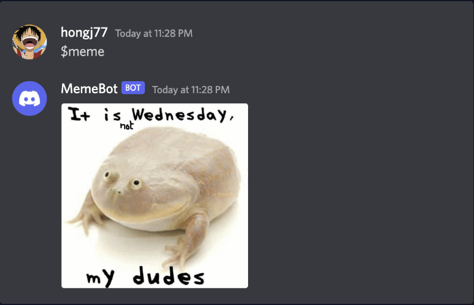

# Discord Meme Bot

A simple Discord bot built with Python and discord.py that fetches and shares memes in your server!

---

## Features
- Fetches random memes from the internet
- Responds to commands in your Discord server
- Easy to set up and customize

---

## Getting Started

### 1. Clone the Repository
```sh
git clone https://github.com/ahmedkurov/discordbot.git
cd discordbot
```

### 2. Install Dependencies
```sh
pip install discord.py requests
```

### 3. Set Up Your Bot Token
- Create a file named `token.txt` in the project directory.
- Paste your Discord bot token inside `token.txt` (no spaces or newlines).

**Never share your token publicly!**

---

## How to Get a Discord Bot Token

1. Go to the [Discord Developer Portal](https://discord.com/developers/applications)
2. Click **New Application** and give it a name.
3. Go to the **Bot** tab and click **Add Bot**.
4. Under **Token**, click **Copy** to copy your bot token.
5. Paste this token into your `token.txt` file.

---

## Adding Your Bot to a Server

1. In the Developer Portal, go to **OAuth2 > URL Generator**.
2. Under **Scopes**, select `bot`.
3. Under **Bot Permissions**, select the permissions your bot needs (e.g., `Send Messages`).
4. Copy the generated URL and open it in your browser.
5. Select your server and authorize the bot.

---

## Running the Bot
```sh
python bot.py
```

---

## Example: Bot in Action

Below are some screenshots of the bot running in a Discord channel:




*Add your own screenshots to the `images/` folder and update the paths above as needed.*

---

## License
This project is licensed under the [GPL-3.0 License](LICENSE).

---

## Credits
- [discord.py documentation](https://discordpy.readthedocs.io/)
- [Meme API](https://meme-api.com/) 